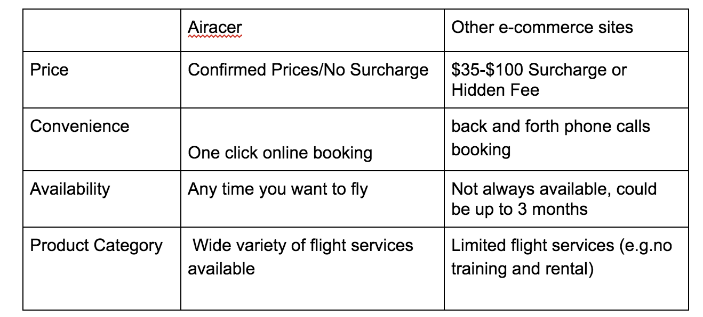
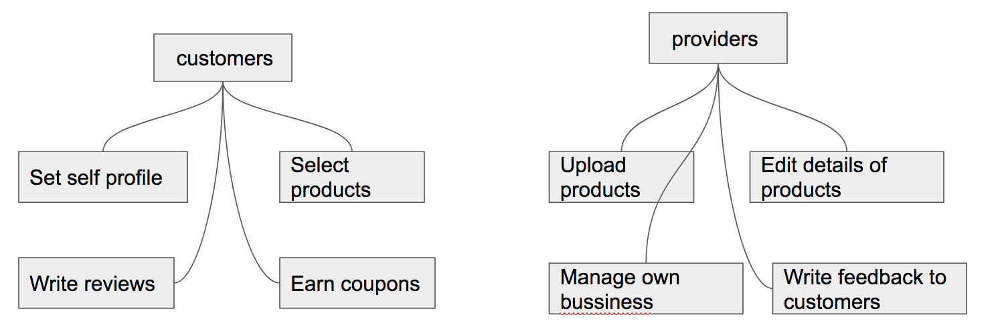
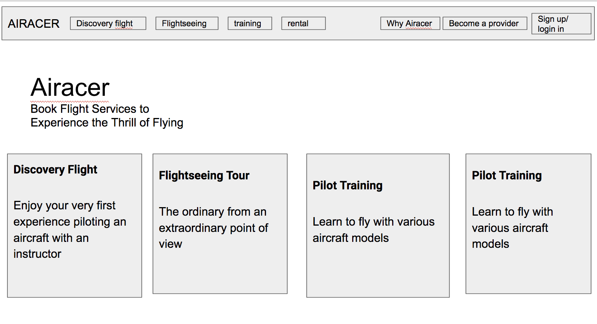
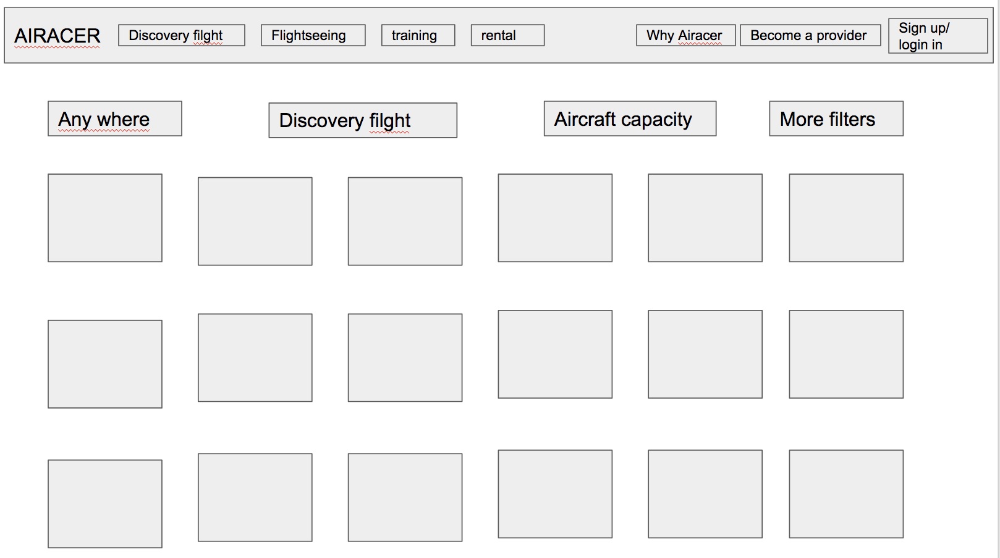
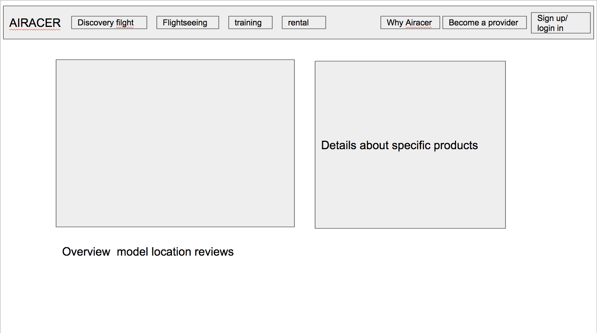
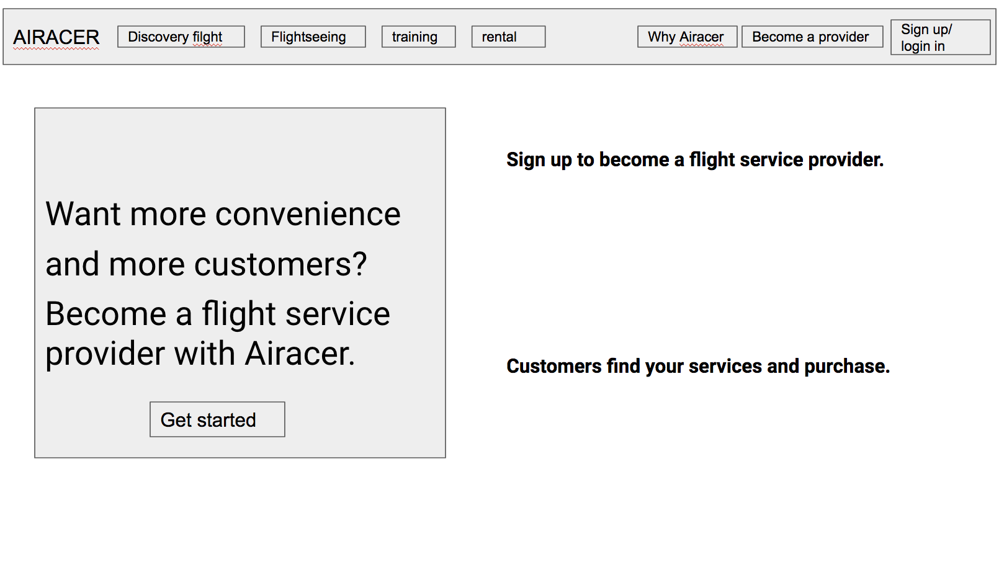

# MSTU 5013 Nelson's Design Document

## demonstration page
https://wei190.github.io/2017fall-final/

## github repo
https://github.com/Wei190/2017fall-final

## firebase page
https://fir-ui-demo-84a6c.firebaseapp.com

## Pitch deck
https://docs.google.com/presentation/d/1975ujocrdRE83jSdcxIs9jkaomrhmwnssfGHr1NGfQo/edit?usp=sharing

## Brief description of my project
The current aviation market, there are a variety of large and small different business models, some of which small flight school, not only the flight quality is difficult to guarantee, while the price is also uneven, often cause consumer confusion. After experiencing the flight study, I think that there is an objective and fair platform to integrate all the flight experience activities and publish it on the website, which will make the aviation market more open and transparent.
That‘s why I create Airacer，Which is an online marketplace to integrate flight service providers with flight lovers and enthusiasts. Airacer partners with prestigious flight schools, flight clubs, individual instructors and commercial pilots throughout the USA to provide our customers with premium flight services including introductory flight, sightseeing flight, flight training and aircraft rental with a variety of aircraft.Also, Airacer professional flight consultants are always ready to serve customers who love the freedom of flying. Customer will receive professional and tailored flight services.

## Topic
I want to create an online marketplace in the General Aviation industry. It is the one-stop shopping site for your overall aviation experience. By seamlessly connecting flight service providers to future pilots, flight enthusiasts and AvGeeks, I want to make flying more accessible. I dedicated to providing a platform where aviation enthusiasts can share their passion with like-minded people. And also the website can help students study fly knowledge online.

## Problem
The current aviation market, there are a variety of large and small different business models, some of which small flight school, not only the flight quality is difficult to guarantee, but also the price is uneven, often cause consumer confusion. After experiencing the flight training, I think if there is an objective and fair platform to integrate all flight types experiences and publish them on website, which will make the aviation market more open and transparent. This helps to remove some fake information. Users can write some reviews for the flight experience which they participate. New users through the fair rating and evaluation to objectively judge and select the flight products.
At the same time, the system also helped flight schools and individual pilots to provide their business model. They can like Uber drivers, to have their own business. This will help them to use their leisure time, earn more money, but also can reduce the average cost of the entire industry, to bring convenience to customers.

## Target Audience
* customers:
If you are a future pilot, flight enthusiast or flight lover, you can enjoy a variety of flight services from introductory flights, to sightseeing flights, to flight training to aircraft rental. We deal with all aircraft types including airplanes, helicopters, gliders, para-gliders, hot air balloons, drones and more!

* service providers:
Whether you run a flight school or are a free-lance certified flight instructor or a commercial pilot, Airacer provides you with a complete management system for your business and your schedule. It even helps you to track aviation weather. More importantly, the Airacer system exposes you and your business to the enormous number of customers waiting to be served by you.

### User Stories
- **User Story 1:**
Casey is a Columbia student. She has bought the 90 minutes experience from academy aviation school in Long Island city. First she thought that would be a bit too long, but she tells  others that time flew away so it was really worth it. she practiced approach and landing at six different airports (you can choose which ever you want, but also listen to the pilots recommendations, since they know which one are more challenging). Although she was only a 22-year-old girl, but through the flight experience several times. Casey said he wanted to be a pilot and enrolled a three-month flight training course by Airacer platform.

- **User Story 2:**
Tao is an engineer work for Google. He based on San Francisco. A couple of months back Tao’s wife had surprised him on his birthday with a 60 minute flight experience. She knew Tao was always interested in flying but never got around to getting flying lessons so she came across Airacer and bought a voucher online. It was Great!

- **User Story 3:**
Darren is a retired teacher living in Florida, and he is 55 years old. Although Darren has retired, but he is very healthy, he still hopes to do something that he really good at and  also can use his own leisure work. Since he used to have a commercial pilot's driver's license, he decided to try when he heard that airacer could help him have his own business, as easy as making money like a Uber driver. Upload his services at any time to expose to the Airacer client. He can make money easily in his spare time. Now he has eight students as an individual instructor.

## Strategy
To Service Providers:
* Airacer provides you with a sophisticated management system, and illuminates your brand and your school to potential flight enthusiasts.
* Airacer’s management system makes sure that you have the best user-friendly experience.
* Airacer’s system fully encrypts your data.
* Airacer charges no fee for the initial management system.

To Customers                                          

### Site Objectives:
My goal is to effectively integrate Airbnb and Uber. Make a website like airbnb or Uber in the sky.I tried to set the system automatically sent surveys after the user end of the experience of the flight, and then write the evaluation of feedback services. But it is more difficult to coding. So at the beginning of the project, I just left the contact mail address. So that customers can use a specific channel, to write the mail and complete the evaluation. At the same time, because the air service is very dependent on the weather, so I need to use this semester new learning API technology to help track the weather situation.

### Success Metrics
I hope to have more and more customers choose to use my website, and more pilots as a product provider join in the system. That will make good financial transactions to ensure the normal operation of the company. When the register customers have grown, we can use data to calculate the most suitable products to customers and the most suitable demand.

## Scope
Different countries have different air policies and restrictions on airspace. So I hope to use three years increase the US market share to 50%, and then do the global expansion. Similar to Europe and then into Asia, China and other countries. The first three years we mainly provide US products, but our consumers can be from all around the world. People who just interested in flying. They may tourists or enthusiasts who want to be pilots.

## Structure

## Skeleton
In the navigation bar, i will provide a detailed description of the website, flight types introduction,, and set aside interactive platform to organize online or offline activities. Provide user registration, consultation and payment services. 

## Prototype and User Tests
Add any findings from your user tests

## Reflection
The final project I based on the midterm examinations, the site has been optimized. In order to give users a better experience. So I added one more page, this page is a product layout page. It can help users search for the desired product. In addition, because different products are in different regions, so I added the google map to retrieve and mark the location. This allows users more clearly to see where the airport is, will greatly reduce the workload of customer service. At the same time, will  help to users make the  decision to buy the product.
 I also added the capabilities of firebase and riot.

In firebase, I try to log in directly via social media, so that users can become our members as quickly as possible，as easy as possible. On one hand, it helps users to reduce the times to enter personal data when they repeatedly purchase products. It also helps me to get  data, conduct accurate advertising and market research. Data is the oil of the future world. If you can easily access user's data, this will be helpful for future expansion of the company.
In terms of riot, I added a few tags features that make it easy for users to find their products for precise retrieval across a wide range of products.
For the web front-end development, I strive to make the product more clean and tidy, with a minimalist model, a clearer expression of my theme. This is also a mainstream design concept of major websites.

There is still a long way to go in developing back-end web pages. We need to design the pages for providers sign up, and manage the data uploaded by provider and customers. (including images and product descriptions, geographic information, etc.) Of course, we have to design the fair and equitable review system for users, by writing the function allows user to check the evaluation. The amount of this project goes far beyond the development of front-end pages, so I still need some time to fully improve the production of this web page.
